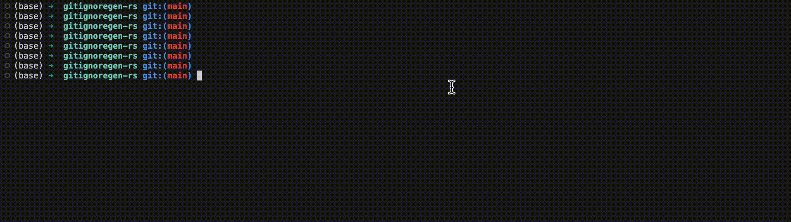

# gitignoregen-rs

A minimal CLI wrapper around [Toptal gitignore](https://www.toptal.com/developers/gitignore). Written in rust using [`dialoguer`](https://github.com/console-rs/dialoguer) and [`reqwest`](https://github.com/seanmonstar/reqwest).

## Installation

```
cargo install gitignoregen
```

## Usage


